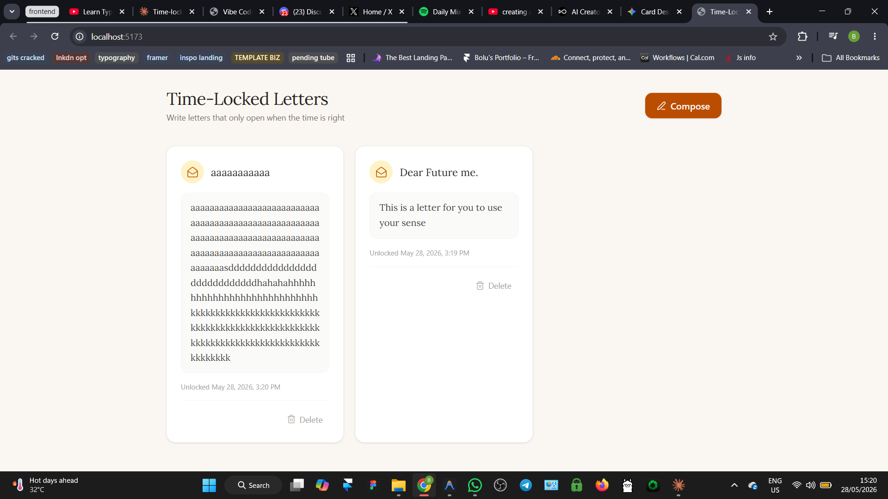

# Tinker Log — The Auto-Stretching Card

We are deploying the app and testing it end-to-end — short vs long letters — to see what holds the card layout together.

---

## The original code

`LetterCard` renders locked and unlocked letters in a responsive CSS Grid. When a letter is unlocked, the content box uses `min-h-[80px]` to set a minimum height but imposes no upper limit. The card itself has no `max-height`:

```tsx
// src/components/LetterCard.tsx:87-91 — the unlocked content box
<div className="w-full min-h-[80px] px-4 py-3 rounded-xl bg-stone-50 border border-stone-100 mb-4">
  <p className="font-serif text-stone-700 leading-relaxed whitespace-pre-wrap break-words">
    {letter.content}
  </p>
</div>
```

```tsx
// src/components/LetterCard.tsx:45-50 — the card wrapper has no max-height
<div
  className={`rounded-2xl p-6 shadow-sm border transition-all duration-300 ${
    unlocked
      ? 'bg-white border-stone-100'
      : 'bg-stone-50/80 border-stone-200/60 saturate-[0.85]'
  } ${showReveal ? 'animate-reveal' : ''}`}
>
```

```tsx
// src/App.tsx:59 — the grid makes all cards in a row equal height
<div className="grid grid-cols-1 md:grid-cols-2 lg:grid-cols-3 gap-5">
```

CSS Grid rows stretch all cells to match the tallest card in the row. If one card stretches to 600px because of a long letter, every card in that row also becomes 600px — leaving small cards with large empty gaps at the bottom.

---

## The experiment

We would be testing in two ways:

1. Write a letter with a short message (~2 sentences) and observe the card height.
2. Write a letter with a long message (~1,500 words) and observe whether the card stretches vertically to accommodate it.



---

## Prediction

My prediction was that the card would auto-adjust its height to fit whatever text is inside. The `min-h-[80px]` sets a floor but no ceiling. CSS Grid would then force every card in the same row to match the tallest one.

For a 1,500-word letter, the card would keep stretching vertically — potentially hundreds of pixels — with no clamp and no scroll. The grid row would balloon, and every neighboring card would inherit that height, creating large empty voids below short letters.

Clicking on a card to "read" the letter would be unnecessary because the entire letter is already fully expanded. The grid becomes the reader.

---

## Result

The prediction was correct.

Cards with short messages rendered at a comfortable height (~120px). Cards with long messages stretched the content box indefinitely. A 1,500-word letter produced a card over 800px tall — roughly three screen-heights on a laptop. The CSS Grid row matched that height, so short cards in the same row sat atop massive empty space.

The app treated every unlocked letter as always-open. There is no "open to read" interaction — the content is either hidden (locked) or fully exposed (unlocked). For a letter app, this means long heartfelt messages break the visual layout. The grid is not a reader; it is a thumbnail gallery being asked to display full documents.

No error. No overflow. No warning. Just a layout that silently degrades as content grows.

---

## What this taught me

`min-h-[80px]` with no `max-height` and no overflow strategy means the card trusts the content to stay short. It is not defensive about long text. Without a clamp:

- `whitespace-pre-wrap` preserves line breaks faithfully. A 40-line letter renders as 40 lines.
- `break-words` prevents horizontal overflow by breaking long unbroken strings. But it does not limit vertical growth — it only handles width.
- CSS Grid's `align-items: stretch` (the default) forces row-mates to match the tallest cell. One long letter poisons the entire row.

The fix is not a single line. It is a design question: should locked letters live in a grid at all? A "read more" popup — tapping a card opens the full letter in a modal or drawer — would keep the grid compact and treat long letters as documents, not thumbnails. Alternatively, clamping with `line-clamp-6` and a "Read more..." button would cap the preview at ~6 lines and let the user expand on click.

Both approaches turn the grid back into a gallery and move reading into a dedicated view — the same way every inbox, notes app, and messaging client handles variable-length content.
